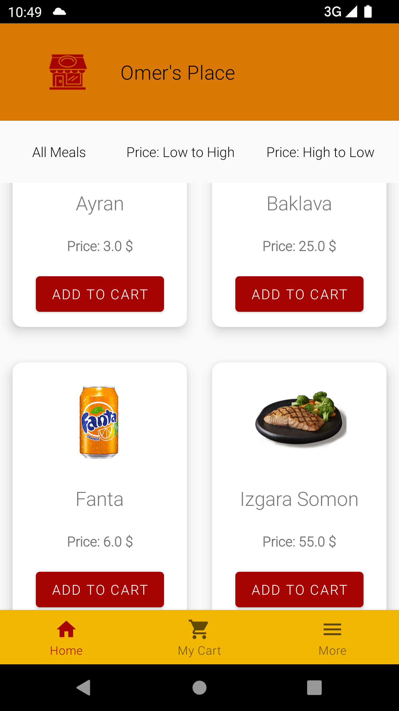
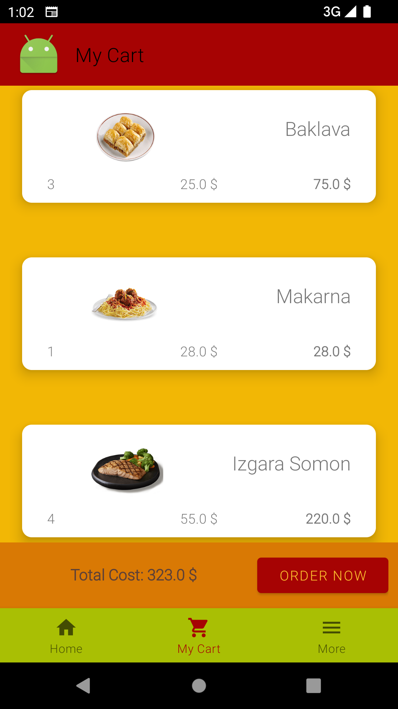
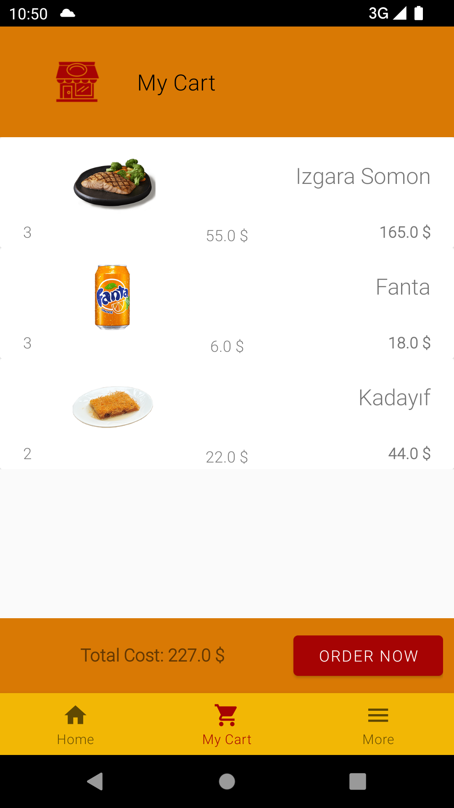

# OmersPlace
 A restaurant app with Kotlin for Android.

<table>
    <tr>
        <td>
        
        </td>
        <td>
        
        </td>
        <td>
        
        </td>
        <td>
        
        </td>
    </tr>
</table>